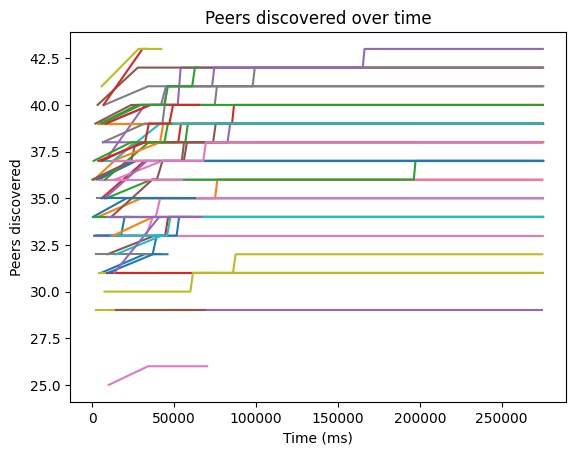

# JVM curency ii application (POC for extending the community to 100 peers)

## Goal and methods

The goal of this repository was to exdent the capabilities of curencyii to accept up to 100 peers while being usable. To do so, we removed the Android part, reduced the app to a CLI and created the perfect environment to experiment and run tests that improve efficiency.

This repository is focused on two experiments:

-   connections per peers over time
-   time to connect to a DAO of increasing size

## Basis of our code

-   [IPv8 - Kotlin implementation](https://github.com/Tribler/kotlin-ipv8) - IPv8 is a P2P protocol providing authenticated communication. Peers in the network are identified by public keys, and physical IP addresses are abstracted away. The protocol comes with integrated NAT puncturing, allowing P2P communication without using any central server. The protocol is easily extensible with the concept of communities which represent services implemented on top of the protocol.
-   [Trustchain supperapp - currencyii](https://github.com/Tribler/trustchain-superapp) - The basis of our implementation when it comes to the logic behind the blockchain management.

If you want to deep dive into technical details of the protocol and understand how existing communities work, please check out the [IPv8 Protocol Specification](doc/INDEX.md). You can also refer to the [py-ipv8 documentation](https://py-ipv8.readthedocs.io/en/latest/).

## Communities

The protocol is built around the concept of communities. A community (or an overlay) represents a service in the IPv8 network. Every peer can choose which communities to join when starting the protocol stack. The following communities are implemented by the IPv8 core:

-   [DiscoveryCommunity](doc/DiscoveryCommunity.md) implements peer discovery mechanism. It tries to keep an active connection with a specified number of peers and keeps track of communities they participate in. It performs regular keep-alive checks and drops inactive peers. While it is possible to run IPv8 without using this community, it is not recommended.
-   [TrustChainCommunity](doc/TrustChainCommunity.md) implements TrustChain, a scalable, tamper-proof and distributed ledger, built for secure accounting.
-   CoinCommunity implements a method of communication between peers that has nothing to do with the trustchain or discovery. These messages are here for triggering events and helping peers in their coordination.

## Project structure

-   demo-jvm (JVM app) - A CLI app demonstrating the calability of curencyii that extends the possible number of peers up to 100.
-   server - a server destined to act as a coordinator for all peers and gather data about each individual. This is purely for running experiments and data gathering. The individuals do not need this server to run.

## Curencyii practices and improvemets

A proposal of swaping the current approach of handling voting (a blocking loop handled by the peer who proposed to join the DAO) with an event based system in which the last peer who vote on the situation is responsible of finishing the transaction. Otherwise, the owner of the request will handle it. [Figure](https://github.com/Tribler/tribler/issues/7914#issuecomment-2003413953)

## How to run

-   start the server for running the experimet or for tracking the state of the peers in a single place
    -   cd server && npm install && npm start
-   build the Trustchain clients into a single jar ./gradlew shadowJar (or by using the ./compileJar.sh script)
-   run ./run_trial.sh n to start n peers

## Building Kotlin-ipv8

When building kotlin-ipv8, run gradlew using JDK 1.8. Either modify your JAVA_HOME path variable to point to JDK 1.8 or add a line to gradle.properties with org.gradle.java.home=</path_to_jdk_directory> (see this [stackoverflow link](https://stackoverflow.com/questions/18487406/how-do-i-tell-gradle-to-use-specific-jdk-version) for a discussion on the topic). Make sure to use forward slashes (/) for your path. To build specific modules, execute gradlew :<module-name>:build. To run, execute gradlew :<module-name>:run. For instance, run the JVM demo with gradlew :demo-jvm:run.

## Building Kotlin-ipv8 as a library using Gradle

The following list contains reminders and recommendations to help you import this project locally using Gradle,
when using it as a library.

-   The project's root folder contains a build.gradle file that defines variables and dependencies that are used by
    the other build.gradle files in different modules. In order to use this project as a library, your own build.gradle
    file needs to define these variables and dependencies, too. A working template would be to simply copy parts of the root
    folder's build.gradle file.
-   Don't forget to include ':ipv8' into your own settings.gradle,
    as well as the module that you're going to use, presumably ipv8-android or ipv8-jvm.
-   This repository currently uses Gradle version 6.1.1. Ensure that your gradle-wrapper.properties uses the same version.
-   This repository currently uses Java version 1.8. Ensure that your Gradle builds with this, too.
    -   By default, Gradle looks at the JAVA_HOME variable, which might not point to 1.8.
-   This repository currently uses Kotlin version 1.4.21. Ensure that your Gradle builds with this Kotlin version

## Results:

The results of this project is a JVM compatible copy of the Currencii module of the trustchain-super-app, to be used in order to test future implementations in a scalable environment.
In order to demonstrate the usability of this environment, we have used it to measure efficiency metrics:

-   Bandwidth consumtion and network speed when using different protocols [example: Random Gossip vs 25-Fanout](https://github.com/Tribler/tribler/issues/7914#issuecomment-2031961143).

-   The evolution of peers discovery over time.

-   The speed of peers joining a DAO with variable number of voters.
